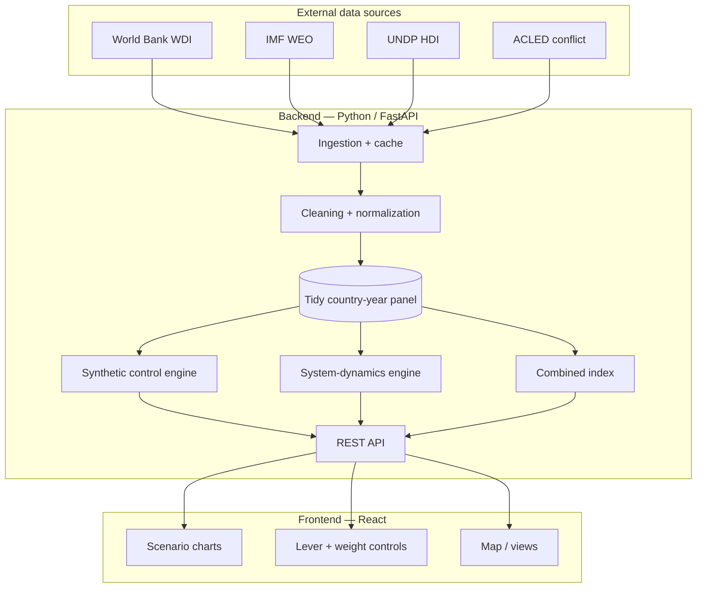
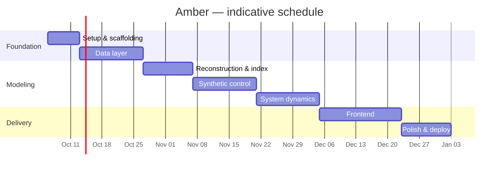

# Amber — Project Plan & Proposal

**A simulation of Myanmar's development — past, present, and the future that almost was.**

| | |
|---|---|
| **Project** | Amber |
| **Author** | Htet Aung Lwin (Zorrow) — [github.com/Zorrow14](https://github.com/Zorrow14) |
| **Type** | Full-stack portfolio project (data engineering · modeling · web app) |
| **Status** | Early / scaffolding |
| **Date** | October 2026 |

---

## 1. Executive summary

Amber is an interactive simulation of Myanmar's national development. It reconstructs the country's real trajectory since the 2011 reform era, estimates a **counterfactual** — how Myanmar might have developed had the 2021 coup not interrupted its democratic transition — and lets a user explore alternative futures through an adjustable model.

The counterfactual is the centre of the project. Rather than asserting an outcome, Amber assembles a *synthetic Myanmar* from a weighted blend of comparable countries that did not rupture in 2021, calibrated to match real Myanmar before the coup. The divergence that opens up afterward is a defensible, data-grounded estimate of what changed.

The project is deliberately built as an **analytical instrument, not an argument**: its assumptions are surfaced as adjustable controls so that the data and the user's own choices — not a predetermined conclusion — drive what is shown. It is designed as a portfolio piece demonstrating a full data-to-deployment pipeline: ingestion, cleaning, econometric modeling, simulation, and an interactive frontend.

---

## 2. Background & motivation

From 2011 to 2019, Myanmar underwent a rapid political and economic opening. Growth averaged around 6% a year, poverty fell sharply, foreign investment surged, and connectivity leapt from near-zero to near-saturation after the 2013 telecom liberalization. The civilian government codified an ambitious forward agenda in the **2016 Economic Policy** and the **Myanmar Sustainable Development Plan (2018–2030)**, which set out explicit goals for growth, human development, and — notably — innovation.

The February 2021 coup interrupted that trajectory. This creates an unusually clean setting for counterfactual analysis: a strong, well-documented pre-2021 trend, sharply broken by a discrete event, against a set of regional peers that continued on similar paths. Amber exploits that structure to ask a concrete, answerable question — *what was the development cost of the interruption?* — and to make the answer explorable rather than asserted.

Beyond the subject matter, the project is a vehicle for demonstrating end-to-end engineering competence relevant to data and ML roles: building a reproducible data pipeline, applying a recognised causal-inference method, implementing a dynamic simulation, and shipping it as a deployed, interactive application.

---

## 3. Objectives

**Primary objectives**

1. Reconstruct Myanmar's real development trajectory (2011–present) from authoritative indicator data across economic, technological, and human-development dimensions.
2. Produce a transparent counterfactual estimate of a "no-coup" trajectory using the synthetic control method.
3. Build an interactive system-dynamics model that lets users adjust key levers and observe alternative futures to ~2035.
4. Unify the above under a user-configurable **combined development index**.
5. Deploy the result as a public, interactive web application.

**Secondary objectives**

6. Maintain a fully reproducible pipeline (raw data → cleaned panel → model outputs) that can be re-run as new data is released.
7. Document methodology and assumptions clearly enough that a reader can critique or reproduce the analysis.

---

## 4. Scope

**In scope**
- Myanmar plus a donor pool of regional peer economies (e.g. Vietnam, Cambodia, Bangladesh, Laos, Nepal, Indonesia).
- National-level indicators from ~2000 onward, with a modeling window anchored at 2011.
- Three modeling layers (reconstruction, counterfactual, future scenarios) and a combined index.
- An interactive frontend with scenario controls and a deployed backend API.

**Out of scope (for the initial version)**
- Subnational / state-region granularity (candidate for future work).
- Agent-based or individual-level micro-simulation.
- Real-time data streaming; the pipeline is batch and re-runnable, not live.
- Forecasting presented as authoritative prediction — outputs are explicitly scenario-based and uncertainty-aware.

---

## 5. Methodology

Amber is organised as three layers over a shared data panel.

### 5.1 Past — empirical reconstruction
Real indicator series are ingested, cleaned, and normalized into a tidy country-year panel. This layer is descriptive: it shows what actually happened and establishes the pre-treatment trend the counterfactual depends on.

### 5.2 Counterfactual — synthetic control
A *synthetic Myanmar* is constructed as a weighted combination of donor-pool countries, with weights chosen so the synthetic unit tracks real Myanmar as closely as possible across the pre-2021 period on both the outcome and a set of predictors. After the 2021 treatment point, the divergence between real and synthetic Myanmar estimates the effect of the interruption. Robustness is assessed with placebo tests (applying the method to untreated donors) and by varying the donor pool.

### 5.3 Future — system dynamics
A stock-and-flow model represents development as interacting stocks (physical capital, human capital, infrastructure/connectivity, institutional stability) linked by feedback loops — most importantly the connectivity → productivity → investment → infrastructure cycle. Users adjust levers (stability, investment openness, education and health spending, connectivity) and a "coup / no-coup" switch to generate divergent trajectories to ~2035.

### 5.4 Combined development index
Selected indicators are grouped into three pillars — **economy**, **innovation/technology**, and **human development** — each normalized and aggregated (geometric-mean style, so weakness in one pillar cannot be masked by strength in another). Pillar weights are exposed as frontend controls, turning "how development is defined" into an explicit, adjustable choice rather than a hidden assumption.

---

## 6. System architecture

---

## 7. Technology stack

| Concern | Choice |
|---|---|
| Backend / API | Python · FastAPI |
| Data handling | pandas · (SQLite/parquet cache) |
| Econometrics | statsmodels · scikit-learn · a synthetic-control library |
| Simulation | PySD (system dynamics) |
| Frontend | React · Recharts / Plotly |
| Deployment | Vercel (frontend) · Render (API) |
| Tooling | Git/GitHub · GitHub Actions (CI) · pytest |

---

## 8. Data management plan

- **Sources:** World Bank WDI (primary), IMF WEO (cross-check), UNDP (HDI), ACLED (conflict intensity). Where available, sources are fetched through their APIs / structured providers rather than scraped.
- **Consistency rule:** one source per indicator, applied identically across all countries — mixing vintages or fiscal-year conventions across sources is treated as a defect, not a convenience.
- **Provenance:** raw pulls are cached unmodified; all cleaning is scripted so the path from raw to modeling panel is fully reproducible.
- **Gaps:** missing values are interpolated or flagged explicitly; series that go dark (e.g. some Myanmar indicators after 2020) are documented and handled with proxies where sensible.
- **Reference targets:** the 2016 Economic Policy and MSDP 2018–2030 supply qualitative milestones for the no-coup scenario (direction and targets, not published numbers).

---

## 9. Project phases & timeline

Estimated at part-time effort; durations are indicative and adjustable.

| Phase | Focus | Est. |
|---|---|---|
| **0 — Setup** | Repo, environment, CI, project skeleton | ~1 wk |
| **1 — Data layer** | Ingestion, caching, cleaning; one pillar end-to-end | ~2 wks |
| **2 — Reconstruction + index** | All pillars, combined index, static charts | ~1.5 wks |
| **3 — Counterfactual** | Synthetic control + placebo/robustness tests | ~2 wks |
| **4 — Future model** | System-dynamics engine + levers | ~2 wks |
| **5 — Frontend** | Interactive charts, controls, views | ~2.5 wks |
| **6 — Polish & deploy** | Adjustable weights, deploy, documentation | ~1.5 wks |

### Milestones
- **M1** — Data pipeline produces a clean multi-country panel (end of Phase 1).
- **M2** — Past reconstruction + combined index demo-able (end of Phase 2).
- **M3** — Counterfactual divergence chart with robustness checks (end of Phase 3).
- **M4** — Interactive future scenarios working (end of Phase 4).
- **M5** — Deployed public application (end of Phase 6).

---

## 10. Deliverables

- Reproducible data pipeline (raw → cached → cleaned panel).
- Synthetic-control counterfactual module with robustness diagnostics.
- System-dynamics simulation module with adjustable levers.
- Combined development index with configurable weights.
- FastAPI backend exposing model outputs.
- Deployed React frontend with interactive scenarios.
- Methodology & assumptions documentation; project README.

---

## 11. Risks & mitigations

| Risk | Impact | Mitigation |
|---|---|---|
| **Data-source inconsistency** (fiscal vs calendar year, differing vintages) corrupts the counterfactual | High | One source per indicator across all countries; IMF used only as cross-check; document every choice |
| **Sparse / discontinued series** for Myanmar post-2020 | Medium | Interpolate/flag; use continuous proxies (e.g. mobile subscriptions for connectivity) |
| **Unreliable pre-2011 statistics** (military-era) | Medium | Anchor the modeling window at 2011; exclude earlier years from calibration |
| **Counterfactual over-interpreted as prediction** | Medium | Present with uncertainty; placebo tests; explicit "estimate, not forecast" framing in the UI |
| **Scope creep** across three modeling layers | Medium | Build as a vertical slice (one pillar end-to-end first); phase gates |
| **Donor-pool contamination** (a peer with its own 2021+ shock) | Medium | Screen donors; exclude countries with concurrent crises; test pool sensitivity |

---

## 12. Evaluation & success criteria

- **Reproducibility:** the pipeline re-runs from raw sources to outputs without manual steps.
- **Counterfactual credibility:** synthetic Myanmar tracks the real pre-2021 series closely (low pre-treatment error) and passes placebo checks.
- **Usability:** a non-expert can adjust levers and index weights and understand what changed.
- **Completeness:** all three layers function and are deployed and publicly accessible.
- **Transparency:** assumptions and limitations are documented and visible in the app.

---

## 13. Ethical considerations

The 2021 coup is a real and politically sensitive event. Amber treats it as a documented occurrence with measurable economic consequences and takes no partisan stance. The tool is framed as analytical rather than advocacy: it surfaces assumptions as adjustable controls, cites its data sources, and presents outputs as uncertainty-aware estimates rather than claims. Public-facing text is written to be neutral and factual.

---

## 14. Future work

- Subnational (state/region) modeling and mapping.
- A richer innovation pillar as more R&D / digital-economy data becomes available.
- Scenario saving/sharing and comparison views.
- Sensitivity dashboards exposing how conclusions depend on donor pool and index weights.

---

## Appendix — indicative indicators

| Pillar | Example indicators |
|---|---|
| Economy | GDP per capita (constant), GDP growth, FDI (% GDP), poverty headcount |
| Innovation / tech | Internet users (% pop), mobile subscriptions (per 100), high-tech exports |
| Human development | Life expectancy, under-5 mortality, secondary enrollment, health spend (% GDP) |
