# Amber

> A simulation of Myanmar's development: past, present, and the future that almost was.

[](https://github.com/Zorrow14/project-amber/actions/workflows/ci.yml)
[](LICENSE)


**Live demo:** *https://amber-sim.vercel.app/*

Amber asks three questions about Myanmar:
- What happened after the 2011 reforms?
- What might have happened without the February 2021 coup?
- What could still happen, to 2035?

It answers them with three methods over one World Bank panel, joined by a development index whose definition you control:
- **The past** is reconstructed from real indicator series.
- **The counterfactual** is estimated with the synthetic control method: a weighted blend of six regional peers fitted to Myanmar before 2021.
- **The future** is explored with a calibrated system-dynamics model, using live stability and policy levers.

Every number is presented as what it is: an estimate against a constructed comparison, or a scenario under stated assumptions, never a forecast.

> **An analytical instrument, not an argument.** Amber treats the 2021 coup as a documented event with measurable consequences and takes no partisan stance. Its assumptions (the donor pool, the index weights, the lever ranges) are exposed as controls, and its limits are documented in [LIMITATIONS.md](docs/LIMITATIONS.md).

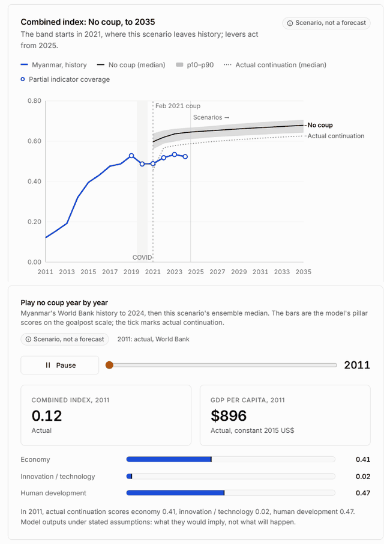

*The Future view's player: real history, then the no-coup scenario's median, year by year. Every frame is a model output for that year, under the "scenario, not a forecast" badge.*


 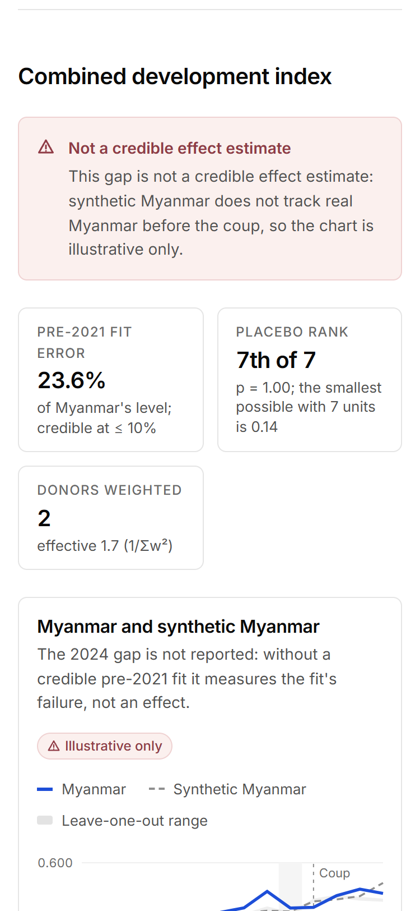

### In brief

- **GDP per capita.** By 2024 Myanmar's real GDP per capita was **about 26% below** a synthetic no-coup Myanmar ($1,158 against $1,571).
  - Its pre-coup fit is close: 2.8% error.
  - It ranks first of seven in placebo tests, the strongest result seven units allow (p = 1/7). It is not "significant at 5%".
  - The size depends on the specification, from −24% to −34%.
- **The combined index has no credible counterfactual.** Myanmar starts below every peer, so no blend of them can match it. The app says so and does not report that gap as an effect.
- **Scenarios to 2035.** Under the model's assumptions, a no-coup path ends **+$534** above actual continuation in GDP per capita (p10–p90 +$324 to +$730), and above it in all 200 ensemble members. These are scenarios, not forecasts, and actual continuation is likely optimistic.
- **The long run, 1960–2024.** A path that grows Myanmar's 1960 level at Thailand's actual rates ends 2024 at 1.25× Myanmar's actual GDP per capita. Anchored in 1988 or later, the same path ends *below* actual. This is an illustration, not an estimate, and Myanmar's pre-1990 figures are low reliability. See [Historical arc](#historical-arc).

### Features

- **Five views:**
  - **Overview:** the headline divergence.
  - **Historical arc:** GDP per capita from 1960, with low-reliability years hatched, the modeling window bracketed, and an illustrative long-run divergence.
  - **Past:** pillar-weight sliders recompute the index live.
  - **Counterfactual:** real against synthetic, the placebo distribution and the donor weights.
  - **Future:** choose a stability path, move four policy levers, and a 200-member ensemble re-runs live.
- **The caveats travel with the data:**
  - hollow points for partial indicator coverage;
  - a not-credible banner and an *Illustrative only* badge where a fit fails its gate;
  - "Scenarios, not forecasts" on every projection.

  The API carries every verdict, tests guard every one, and none can disappear while a chart is loading.
- **Honest robustness.** Placebos in space and time, leave-one-out donors, fit-window and rebasing variants, a backtest credibility gate, and the parameters the data can't identify profiled into the uncertainty bands rather than hidden.
- **Built to be checked:**
  - every modeling constant in one file, [`config.py`](src/amber/config.py);
  - 316 offline backend tests and 25 frontend tests;
  - a browser smoke test at desktop and phone width;
  - a hermetic, hash-checked data snapshot, so the deployed API makes no outbound calls.
- **Motion that follows the data.**
  - Lines draw their paths and the counterfactual reveals in order: real, then synthetic, then the gap (credible outcomes only). The fan widens out of history, and numbers count to their values.
  - A year-by-year player steps through a scenario or the long-run divergence.
  - Caveats never wait for an animation. Under `prefers-reduced-motion` nothing moves and the final state renders at once.
- **English and Burmese (မြန်မာ).** Every string, including the caveats and the data labels from the API, switches with one toggle. The default comes from the browser's language. See [Internationalization](#internationalization).
- **Accessible and responsive.** Keyboard focus, a text summary and data table for every chart, no distinction by color alone, and layouts that hold at 375 px. A sleeping free-tier API shows a clear "waking the server" state instead of a blank page.

### Documentation

| Document | What it covers |
|---|---|
| [docs/METHODOLOGY.md](docs/METHODOLOGY.md) | How each layer works and why, tied to the `config.py` constant that encodes each decision |
| [docs/LIMITATIONS.md](docs/LIMITATIONS.md) | What Amber cannot tell you: data gaps, source caveats, the thin donor pool, the model's assumptions, and a note on neutrality |
| [docs/design-system.md](docs/design-system.md) | The UI's tokens, palettes (with their validation), type, primitives and chart grammar |
| [docs/i18n-review.md](docs/i18n-review.md) | The Burmese strings awaiting review by a Burmese speaker, with the glossary and how to sign them off |
| [DEPLOY.md](DEPLOY.md) | Step-by-step Render + Vercel deploy, smoke and manual QA checklists, operations |
| [CHANGELOG.md](CHANGELOG.md) | Release history, phases 1–6 |
| [docs/Amber-Project-Plan.md](docs/Amber-Project-Plan.md) | The original plan: scope, architecture, phases, risks |
| [docs/myanmar-precoup-calibration-reference.md](docs/myanmar-precoup-calibration-reference.md) | The pre-coup trajectory and the civilian government's forward plans |

### Run it locally

Requires Python 3.11+ and Node 22+. Everything runs offline from the committed snapshot.

```bash
make install            # .venv + pip install -e ".[dev]"
make api                # the API on :8000, serving data/release
make frontend-install   # in a second terminal
make frontend-dev       # the app on http://localhost:5173
make test               # backend + frontend tests, no network
```

Without `make`:
1. `python -m venv .venv`, then `.venv/bin/pip install -e ".[dev]"`.
2. `.venv/bin/python -m uvicorn amber.api.main:app`.
3. In `frontend/`, run `npm ci && npm run dev`.

To rebuild every table from the World Bank yourself, see [Data layer](#data-layer) below.

---

*Amber* has two meanings baked into the name. It's the colour of **Suvarnabhumi**, the "Golden Land", Myanmar's old name. And amber is the substance that freezes a single moment in time forever: here, the moment in 2021 where one timeline broke away from another. This project is an attempt to look at both timelines side by side.

---

## Approach

| Layer | Question | Method |
|-------|----------|--------|
| **Past** | What actually happened? | Real World Bank WDI indicator series, 2011–present |
| **Counterfactual** | What if there'd been no coup? | Synthetic control against a donor pool of peer economies |
| **Future** | What could still happen? | System-dynamics model with user-adjustable levers |
| **Historical arc** | How did it get here, from 1960? | Descriptive WDI series, plus an illustrative divergence scenario (not an estimate) |

A user-adjustable **combined development index** (economy · innovation/tech · human development) ties the layers together. The pillar weights are exposed as controls, so "how you define development" becomes a setting, not an assumption.

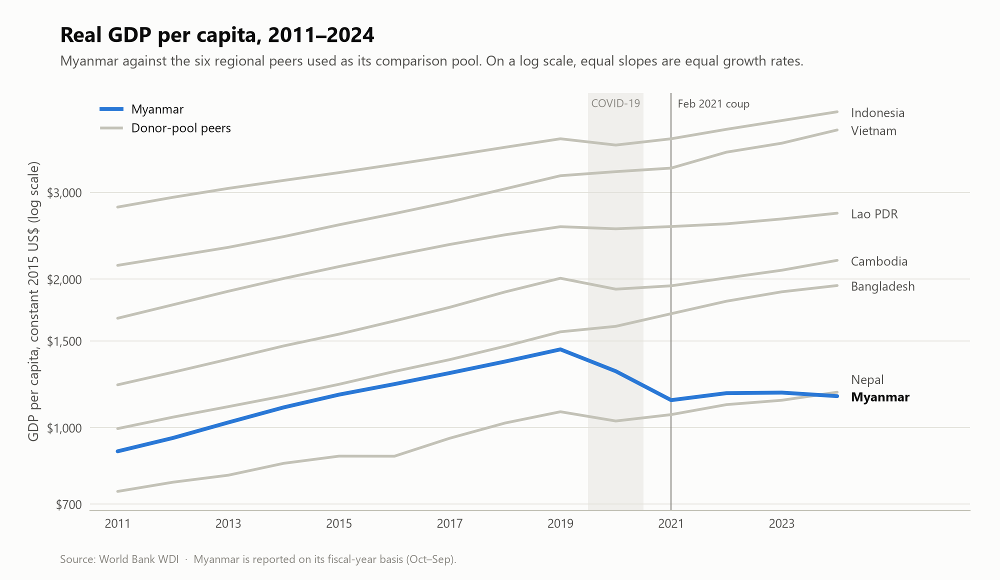

*Real GDP per capita (constant 2015 US$, log scale). Myanmar tracked its peers through 2019, then broke away from them. The [counterfactual](#counterfactual) estimates that by 2024, Myanmar's GDP per capita was about a quarter below a synthetic no-coup Myanmar.*

---

## Tech stack

- **Modeling:** Python · pandas · numpy · scipy (SLSQP synthetic-control weights, least-squares calibration) · a hand-written system-dynamics simulator
- **API:** FastAPI · Pydantic v2, serving a committed, hash-checked data snapshot, with ETag caching and gzip
- **Frontend:** React 19 · TypeScript (strict) · Vite · Recharts · a small typed i18n layer (no library) · Inter and Noto Sans Myanmar
- **Quality:** pytest · Vitest + Testing Library · ruff · ESLint · GitHub Actions · a CDP browser smoke test
- **Deploy:** Render (API) · Vercel (frontend)

## Data and attribution

- **World Bank, World Development Indicators (WDI).** Every series in the panel and the app comes from WDI. It is licensed under [Creative Commons Attribution 4.0 (CC BY 4.0)](https://creativecommons.org/licenses/by/4.0/), and `data/release/` redistributes derived tables under that licence, with attribution. Source: World Bank, *World Development Indicators*, retrieved via the World Bank API.
- **Goalpost standards (values cited, no data redistributed):**
  - UNDP, *Human Development Report 2025 Technical Notes*: the life-expectancy bounds (20–85).
  - Sustainable Development Solutions Network, *Sustainable Development Report 2026*: the under-5 mortality bounds (2.6–130).
- **Cross-checks, not inputs:**
  - IMF *World Economic Outlook* growth figures are tabulated in [the calibration reference](docs/myanmar-precoup-calibration-reference.md) for comparison only. They enter no computation, because they use a different fiscal-year basis.
  - Government of Myanmar planning documents (the *2016 Economic Policy*, the *Myanmar Sustainable Development Plan 2018–2030*) inform the scenario directions.
- **Literature.** The connectivity-productivity assumption is benchmarked against [Czernich et al. (2011)](https://ideas.repec.org/a/ecj/econjl/v121y2011i552p505-532.html), *Economic Journal* 121(552).

- **Maddison Project Database 2023** (Bolt and van Zanden 2024, CC BY 4.0) is optional, for the pre-1960 segment of the historical chart only. It is not bundled: you supply the export, as described in [`data/external/README.md`](data/external/README.md).

Conflict-event data (e.g. ACLED) and UNDP's HDI series are **not** used. See [LIMITATIONS.md](docs/LIMITATIONS.md) for what that leaves out.

---

## Data layer

The pipeline pulls 11 indicators across 7 countries (Myanmar plus the donor pool) for 2000–2024 from the World Bank WDI, caches every raw pull, and writes a tidy country-year panel.

```bash
make install      # venv + dependencies
make panel        # fetch (cached) → clean → write
make refresh      # same, but re-pull everything from the API
make index        # development index + charts (see below)
make sc           # synthetic-control counterfactual + charts
make sd           # future scenarios + charts
make historical   # 1960+ history + the illustrative divergence (make models = sc + sd + historical)
make test         # offline test suite
make lint         # ruff check + format check, and ESLint
```

Without `make`, the same steps are `python -m venv .venv`, `pip install -e ".[dev]"`, then `python scripts/build_panel.py [--refresh]`, `pytest`, `ruff check .`.

**Outputs** land in `data/processed/` (gitignored — always regenerable), each as both `.csv` and `.parquet`:

| File | Contents |
|---|---|
| `panel` | The tidy panel: `indicator_id, indicator_name, pillar, country_iso3, country_name, year, value, pre_2011`. Missing values stay `NaN`. |
| `panel_interpolated` | The same panel with **interior** gaps bridged linearly within each country-indicator series, plus an `imputed` flag. Nothing is extrapolated past the last real observation. |
| `coverage_report` | Observation counts per country × indicator, with `is_dark` marking series that stop reporting before 2021. |

Raw API responses are cached in `data/raw/` as parquet, each with a JSON sidecar recording the indicator, countries, year range and fetch time — so a rebuild is reproducible and runs offline.

**Two rules the code enforces:**

- **One source per indicator.** Every numeric series is WDI, applied identically to all countries. The IMF figures in [`docs/myanmar-precoup-calibration-reference.md`](docs/myanmar-precoup-calibration-reference.md) are a cross-check only — they sit on a different fiscal-year basis, and mixing them in would corrupt the counterfactual.
- **Gaps stay visible.** Nothing is silently filled. Interpolation is a separate, labelled artifact, and series that go dark are reported rather than quietly extended.

Modeling decisions (donor pool, treatment year, the 2011 window) live in [`src/amber/config.py`](src/amber/config.py), not scattered through the logic.

---

## Development index

The combined development index is built from three pillars. Each one is the geometric mean of its indicators:

| Pillar | Indicators |
|---|---|
| **Economy** | GDP per capita · GDP growth · FDI net inflows |
| **Innovation / technology** | Internet users · mobile subscriptions |
| **Human development** | Life expectancy · under-5 mortality · secondary enrollment · health expenditure |

**Two panel series are kept as history but left out of the index.** Amber compares the same index across the past, the counterfactual and 2035 projections, so it can only contain indicators all three can produce:

- **Poverty headcount ($2.15/day).** Myanmar has three observations (2015–2017). In the index it entered Myanmar's score for those three years only, which is a change of composition rather than of development.
- **High-tech exports.** Myanmar's series is erratic (0.2–7.5% of manufactured exports) and has no structural driver, so no counterfactual or projection can produce it.

Both remain in the panel, and their polarity and goalposts stay configured, so reversing the exclusion is a one-line change to `config.INDEX_EXCLUDED`. The cost is breadth: the innovation pillar now measures connectivity adoption only.

It is built in three steps, and every parameter lives in [`config.py`](src/amber/config.py):

1. **Normalize.** Each indicator is rescaled to [0, 1] against **fixed goalposts**: a low and a high bound per indicator, set in config and never recomputed. Every country-year sits on the same ruler, whether it's historical, a counterfactual or a 2035 projection. Adding a country or a new data vintage can't change a past score. Pre-2011 rows are excluded because military-era statistics aren't reliable enough to calibrate against.
   - **Polarity.** Under-5 mortality is lower-is-better, so it's inverted: `(high − x) / (high − low)`.
   - **Log income.** GDP per capita is taken as `ln(x)` first, following the HDI. An extra $1,000 matters more at $1,000 per head than at $5,000.
   - **Floor.** Scores are clipped to [0.01, 1], so no single worst value can drive a geometric mean to zero.
2. **Pillar sub-index.** The geometric mean of the normalized indicators *observed* in that country-year. Missing isn't scored as zero. A `coverage` column records what share of the pillar's indicators were present.
3. **Combined index.** `exp(Σ wᵢ · ln pᵢ / Σ wᵢ)` across the three pillars. The weights default to equal and are renormalized, so they can be given on any scale. A country-year gets a combined score only if every pillar with a positive weight is present. Otherwise a strong pillar would stand in for a missing one.

Geometric means are used throughout so that a strong economy can't hide a collapsing health system.

**Goalposts.** A published standard is used wherever one exists. The other bounds were seeded once from the 2011–2024 range: padded by 25% of the observed span on each side, clamped to the indicator's natural limits (a percentage can't pass 100), rounded outward, then frozen. The source of every bound is recorded in [`config.GOALPOSTS`](src/amber/config.py).

| Indicator | Low | High | Source |
|---|---|---|---|
| Life expectancy (years) | 20 | 85 | UNDP HDR 2025 Technical Notes (HDI) |
| Under-5 mortality (per 1,000) | 2.6 | 130 | Sustainable Development Report 2026 (SDG Index) |
| GDP per capita (2015 US$, log) | 475 | 6,850 | Seeded |
| GDP growth (%) | −17.5 | 14.5 | Seeded |
| FDI net inflows (% GDP) | −3 | 14.5 | Seeded |
| Internet users (%) | 0 | 100 | Seeded, clamped to 0–100 |
| Mobile subscriptions (per 100) | 0 | 205 | Seeded, clamped at 0 |
| Secondary enrollment (% gross) | 32.5 | 112.5 | Seeded |
| Health expenditure (% GDP) | 0 | 8 | Seeded, clamped at 0 |

The HDI's income goalposts ($100–$75,000) aren't used. They apply to GNI per capita at 2017 PPP, which is a different basis from this series. The panel's own min-max (`--normalization pooled`) is still available for comparison, but it doesn't have the stability described above.

```bash
make index                                                         # table + charts
python scripts/build_index.py --weights economy=2,innovation=1,human_development=1
```

This writes `data/processed/index.csv`, with columns `country_iso3, country_name, year, series, value, coverage`, and renders the charts below to [`reports/figures/`](reports/figures/). [`notebooks/01_reconstruction.ipynb`](notebooks/01_reconstruction.ipynb) walks through the same build step by step. Its outputs are stripped in git, so run it to see the charts inline.

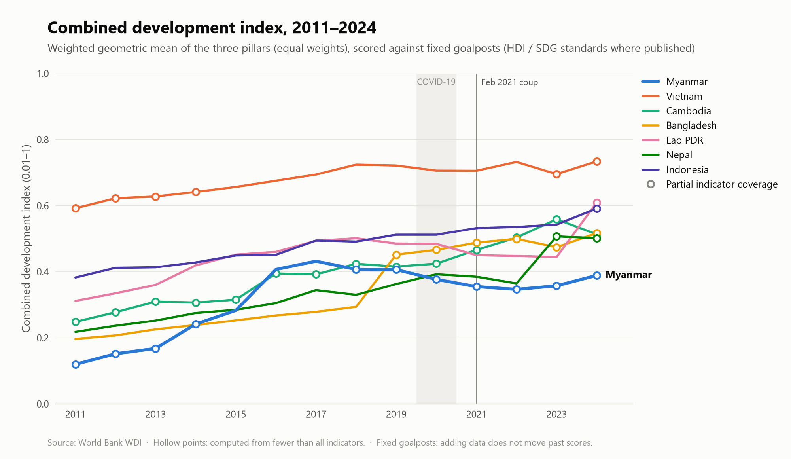

**Coverage moves pillars.** When an indicator stops reporting, the pillar is computed from the ones that remain, and part of any change reflects that. Every partial-coverage point is drawn as a hollow ring. Myanmar reports all nine indicators for 2011–2018. Then secondary enrollment stops after 2018, internet use after 2020, and health expenditure is missing for 2024, so its 2024 score rests on six of nine. The future-scenarios chart measures what that does: in 2024 the model's index is 0.027 higher over all nine indicators than over the six Myanmar reports.

On this composition Myanmar's index rises from 0.12 in 2011 to 0.53 in 2019 and is 0.52 in 2024, level with Bangladesh (0.52) and Nepal (0.50). Read the post-2020 points with their rings in mind.

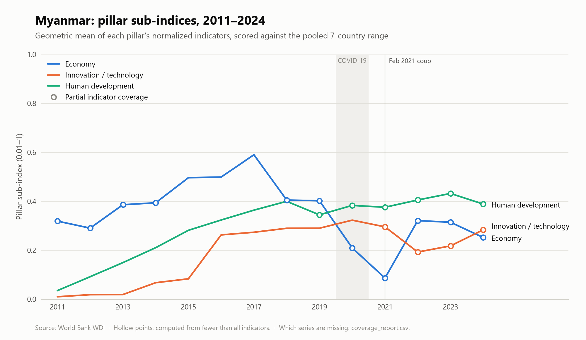

---

## Counterfactual

**The method in plain terms.** No single country shows what Myanmar would have looked like without the coup. The [synthetic control method](https://en.wikipedia.org/wiki/Synthetic_control_method) builds a comparison instead: a weighted blend of the six peers that didn't rupture in 2021, with the weights chosen so the blend tracks real Myanmar as closely as possible from 2011 to 2020. The weights can't be negative and must add up to 100%, so "synthetic Myanmar" always sits within the range of real countries and never extrapolates past them. After 2021, the gap between real and synthetic Myanmar is the estimate.

| Outcome | Synthetic Myanmar | Pre-2021 fit (RMSE) | Credible | 2024 gap | Placebo rank |
|---|---|---|---|---|---|
| **Real GDP per capita** | 61% Nepal + 39% Cambodia | $33 (2.8% of level) | Yes | **−$413 (−26%)** | 1st of 7, p = 0.14 |
| **Combined development index** | 72% Bangladesh + 28% Cambodia | 0.085 (24% of level) | **No** | −0.026 | 7th of 7, p = 1.00 |

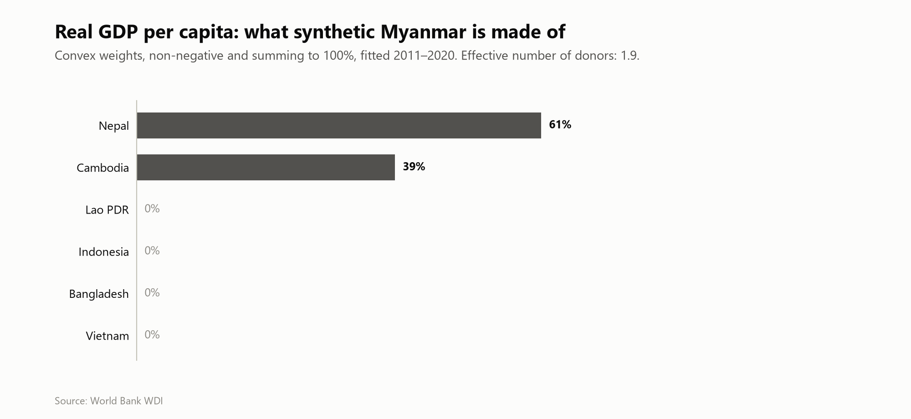 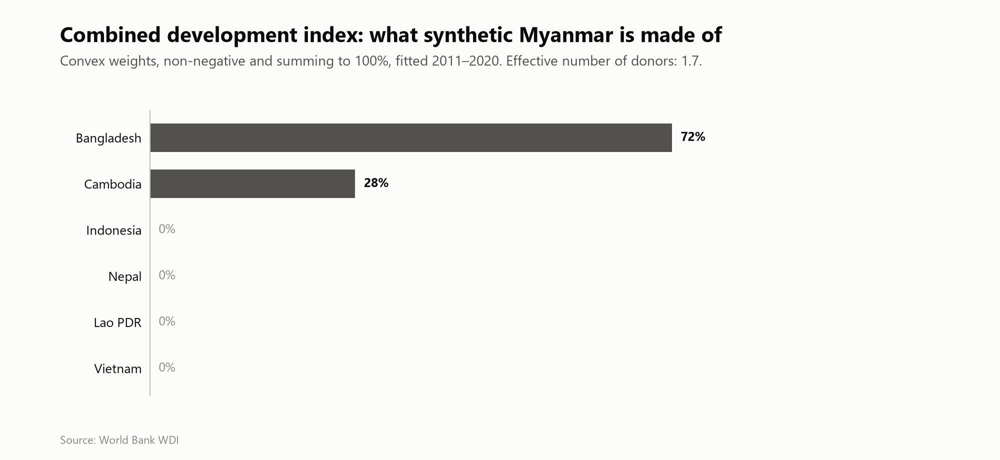

### GDP per capita

Synthetic Myanmar tracks the real one closely through 2019, and the two separate from 2020. By 2024, real GDP per capita is **$1,158 against a synthetic $1,571**.

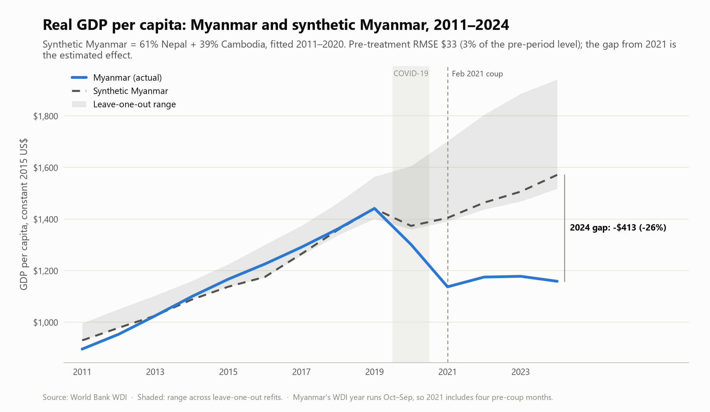

**How to read the inference.** Each donor is refitted as if *it* had been treated in 2021, matched only against the other donors. If Myanmar's gap is real, its post-2021 miss relative to its pre-2021 fit (the post/pre RMSE ratio) should stand out. Myanmar's ratio is 9.9, the highest of the seven. The pseudo p-value is the share of units whose ratio is at least Myanmar's, here 1/7 = 0.14. **That is the smallest p-value seven units can produce.** Ranking first is the strongest result available, but it can never show p < 0.05. The two faint lines are donors on the edge of the donor pool (Indonesia and Nepal) that the others can't match. Their "gaps" reflect a failed fit, not an effect.

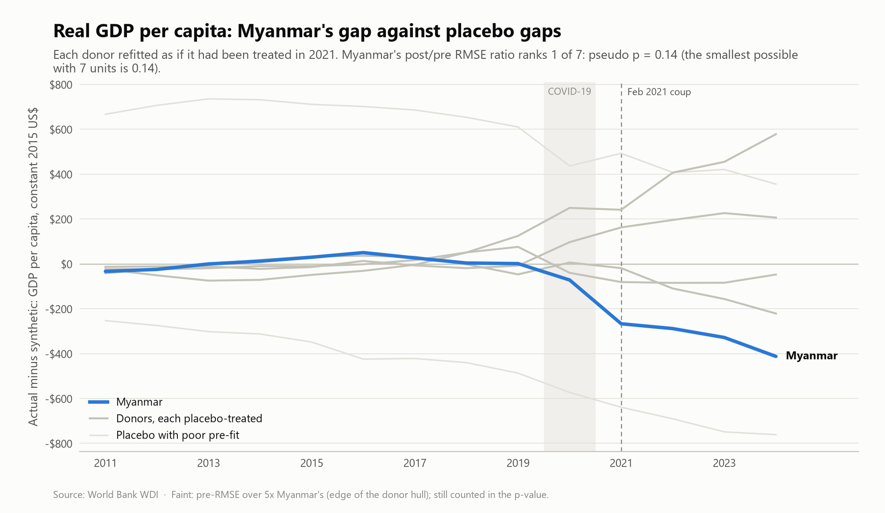

**How robust it is:**

- **Direction: robust.** Dropping either weighted donor keeps a large negative gap in 2024: −$359 without Cambodia, and −$783 without Nepal. The second refit is 100% Bangladesh with a much looser pre-fit ($127), and it forms the wide upper edge of the shaded band.
- **Size: specification-dependent.** Across fit choices the 2024 gap ranges from −24% (series rebased to 2011 = 100) through −26% (default) to −34% (fit ending 2019). Ending the fit in 2019 moves Myanmar to 2nd of 7 (p = 0.29).
- **In-time placebo.** With a fake treatment in 2017, the gap stays near zero for 2017–2019 (+$19, +$6, −$5). The −$165 in 2020 is the anomaly described below.

**The 2020 problem.** WDI records Myanmar on its October–September fiscal year, and assigns each fiscal year to the calendar year containing most of its months. So "2020" is October 2019 to September 2020, entirely before the coup, and it stays in the fit because COVID hit the donors too. But Myanmar's 2020 growth reads −9.1%, below every donor. (The World Bank's own estimate at the time was +0.5%, so the series has since been revised.) No blend of donors can reach that value. "2021" runs October 2020 to September 2021, so the first post-treatment point includes four pre-coup months.

**What the gap measures.** The gap is the combined effect of everything that hit Myanmar and not its peers from 2021 onward. That is mainly the coup and its aftermath, but it also includes anything else specific to Myanmar in those years. It is an estimate against a constructed comparison, not a forecast.

### Combined development index

The same method fails here, and the chart says so. Myanmar starts **below every donor** in 2011–2013, and a blend of donors can't go lower than its lowest member. The pre-fit misses by about a quarter of Myanmar's own level. Rebasing doesn't help either: Myanmar's index grew faster than any donor's in relative terms. So this result is **inconclusive**. It does not show that there was no effect.

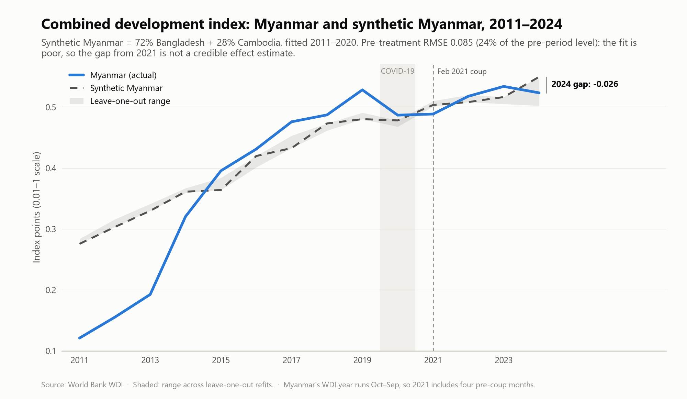

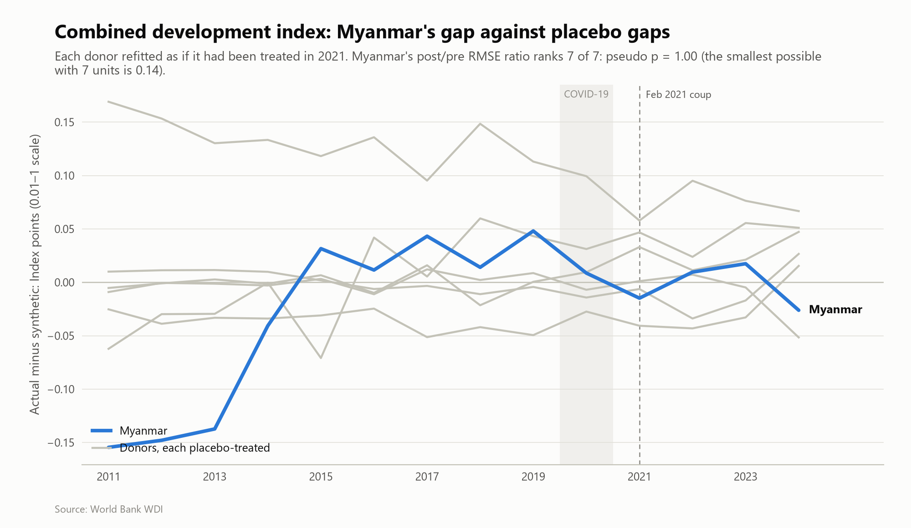

```bash
make sc                                                              # tables + charts
python scripts/build_synthetic_control.py --pre-period-end 2019      # drop 2020 from the fit
python scripts/build_synthetic_control.py --rebase                   # 2011 = 100 variant
```

This writes to `data/processed/`:

- `synthetic_control`: actual, synthetic and gap by year
- `sc_weights`
- `sc_placebo`: Myanmar plus every placebo gap
- `sc_placebo_time`
- `sc_leave_one_out`
- `sc_metrics`: fit, p-value, the in-time ratio, the leave-one-out spread, and both donor counts: `n_weighted_donors` (weight ≥ 1%, the count most papers report) and `n_effective_donors` (1/Σw², which shows how concentrated the weights are). It also carries `credible`, the same verdict the captions state: true only when pre-RMSE is at most `SC_CREDIBLE_PRE_RMSE_SHARE` (10%) of Myanmar's pre-period level.

Every setting is in [`config.py`](src/amber/config.py) under *Synthetic control*. [`notebooks/02_counterfactual.ipynb`](notebooks/02_counterfactual.ipynb) walks through it step by step.

---

## Future scenarios

**These are scenarios, not forecasts.** The future layer is a small model that shows how Amber's assumptions play out to 2035 under different paths for stability and policy. It does not predict what will happen.

**The model in plain terms.** It tracks four quantities, called stocks, for Myanmar:

- **Physical capital**
- **Human capital**, measured through life expectancy
- **Connectivity**, measured as internet users
- **Institutional stability**, which each scenario sets

Output depends on all four. The **feedback loop** runs like this: connectivity raises productivity, productivity raises output, and output pays for both investment and the further spread of connectivity. Stability multiplies productivity, so a more stable country gets more out of the whole loop. Policy **levers** act as multipliers on the calibrated behaviour, where 1.0 means reform-era behaviour: `fdi_openness`, `education_spend`, `health_spend` and `connectivity_investment`. These are the sliders in the app's Future view.

The model is a hand-written annual difference-equation simulator in numpy. The project plan named PySD, and this is a deliberate change: every equation stays visible in the code and can be tested offline, with no separate model file to keep in sync. The equations are in [`system_dynamics.py`](src/amber/modeling/system_dynamics.py).

**Scenarios** (data in [`config.SCENARIOS`](src/amber/config.py)):

| Scenario | Stability | Levers (from 2025) |
|---|---|---|
| Actual continuation | Post-coup level, held | Unchanged |
| No coup | Reform-era level throughout | Unchanged |
| Partial recovery | Post-coup to 2024, then halfway back by 2035 | Unchanged |
| Reform push | Reform-era level throughout | Education and connectivity ×1.5 (MSDP Strategy 3.7) |

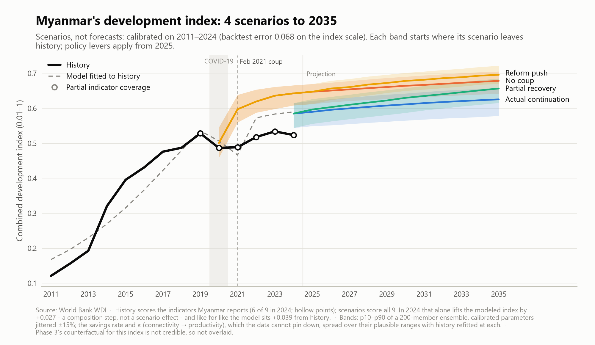

**Headline, 2035** (ensemble median, with the p10–p90 range in brackets):

| Scenario | GDP per capita | Combined index |
|---|---|---|
| Actual continuation | $1,726 ($1,407–$2,177) | 0.626 (0.578–0.659) |
| No coup | **$2,273** ($1,956–$2,734) | **0.678** (0.642–0.705) |
| Partial recovery | $1,960 ($1,659–$2,390) | 0.657 (0.616–0.685) |
| Reform push | $2,314 ($1,990–$2,782) | 0.696 (0.670–0.722) |

**The gap between scenarios, paired member by member.** Every scenario runs on the same 200 parameter draws, so the right comparison is each member against itself. It isn't whether two bands overlap. By 2035, no coup ends **+$534 above actual continuation** in GDP per capita (p10–p90 +$324 to +$730, or +17% to +48%), and **+0.055 on the index** (+0.033 to +0.079). It ends above actual continuation in **all 200 members**. The marginal GDP bands do overlap, because the members disagree more about the overall growth path than about the gap between scenarios. These gaps are in `sd_gaps`.

**The index means the same thing everywhere.** The model produces exactly the nine index indicators, so a projected score and a historical one measure the same thing. What the model can't reproduce is Myanmar's reporting gaps. History after 2018 scores only the indicators Myanmar reports, while scenarios score all nine. The fan chart states the size of that step (+0.027 in 2024) and the model's own miss (+0.039), so a coverage change is never read as a scenario effect. The `combined` row of `sd_metrics` carries `composition_gap`, and its error is computed like for like: the model scored over the same indicators as history each year.

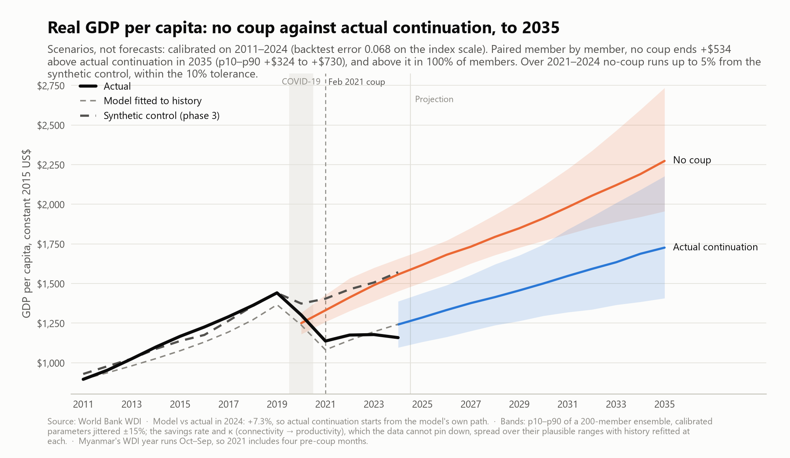

**How it is calibrated, and how far to trust it:**

- **Fit.** Thirteen parameters are fitted by bounded least squares to Myanmar's 2011–2024 indicators, measured on the index's goalpost scale. The backtest error is **0.068 in index units**, within the 0.10 credibility gate, so `credible = true` in `sd_metrics`. Above that gate, every caption would call the scenarios illustrative dynamics. The backtest is in-sample, because the coup's effect can't be estimated without data from after 2021.
- **Two parameters are assumptions, not estimates, and the bands carry them.** The data can't tell apart values of the connectivity effect on productivity (κ, the leapfrog channel Amber is built around) from 0 to 0.5, or of the savings rate from 0.2 to 0.5. The central run holds them at 0.25 and 0.30. But the ensemble spreads across every low, assumed and high combination (nine nodes), refitting all 13 calibrated parameters to history at each. Every run re-checks that they really are unidentified: all eight off-centre nodes fit within ±0.0035 of the central backtest error, against a 0.01 tolerance (`sd_profile`, column `flat`). At the least plausible corner (κ = 0.5, savings 0.5), the refit pushes TFP growth to its floor of 0, and `sd_profile` flags it in `at_bound`. γ, the strength of the stability channel, stays estimated (0.76).
  - **Why κ = 0.25:** it is a one-off level effect of 2.5% of productivity per 10 points of internet use. That is deliberately conservative next to [Czernich et al. (2011)](https://ideas.repec.org/a/ecj/econjl/v121y2011i552p505-532.html), who find that 10 points of broadband raised annual growth by 0.9–1.5 points across the OECD.
- **Consistency with phase 3.** Over 2021–2024 the no-coup scenario sits **5.2%** from the credible synthetic control, within the 10% tolerance. The COVID shock is modelled as a lasting loss, because none of the six donors returned to its pre-2020 trend. That assumption came from the same donors the synthetic control uses, so the two checks aren't fully independent.
- **Known misses.** The model expects recovery growth after the coup, but Myanmar stagnated. By 2024 the model is 7.3% above actual, so **actual continuation is likely optimistic**. Myanmar's internet data stop in 2020, so nothing constrains connectivity after that. The model saturates it by the mid-2020s in every scenario, which is why reform push adds only about $40 over no coup, most of it from education. Health spending as a share of GDP is the worst-fitting indicator (0.125).

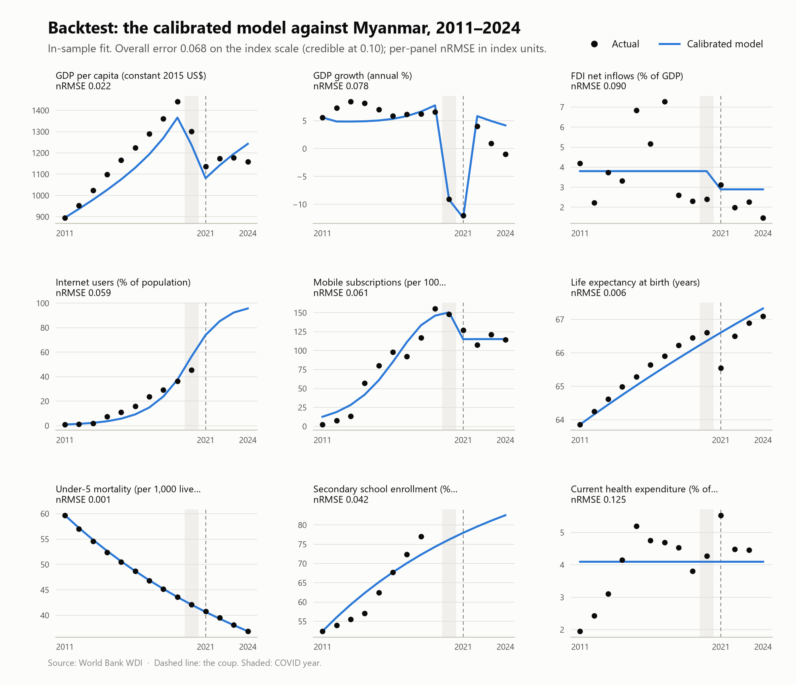

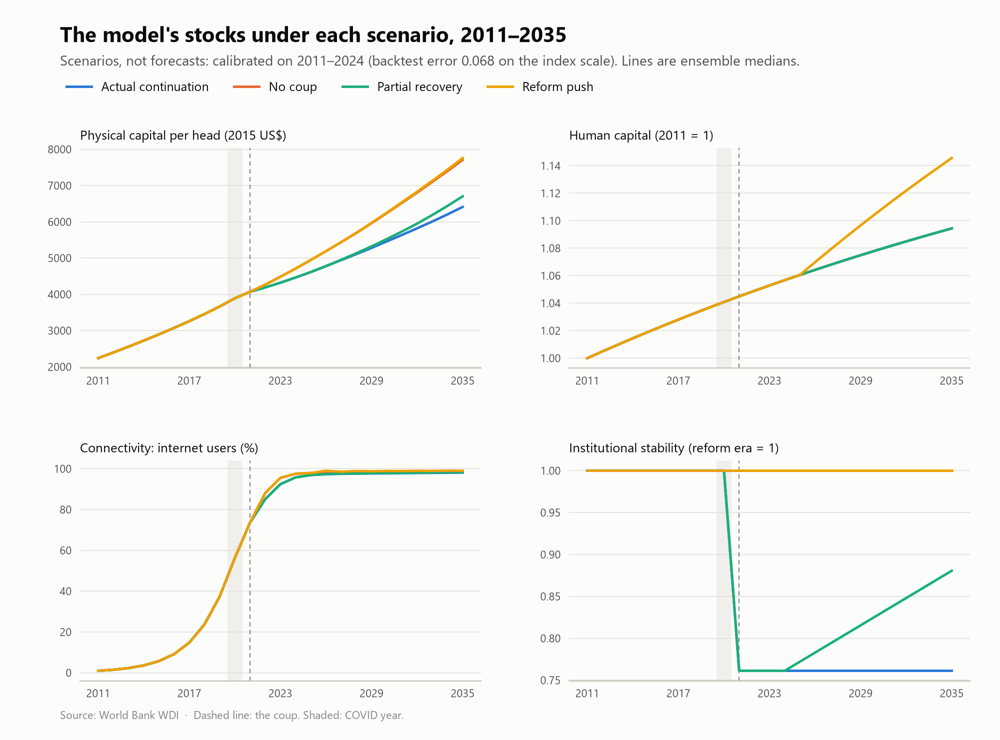

```bash
make sd                                                  # calibrate, run scenarios, write + chart
make models                                              # make sc, then make sd
python scripts/build_system_dynamics.py --ensemble-size 500
```

This writes to `data/processed/`:

- `sd_trajectory`: every stock, modeled indicator, pillar and the combined index, by scenario and year, at p10, p50 and p90
- `sd_scenarios`
- `sd_calibration`, which flags any fitted parameter that ends up at the edge of its allowed range (`at_bound`) and marks the `unidentified` ones
- `sd_metrics`: backtest error overall and per indicator, the `credible` gate, the phase 3 overlap check, and the combined index's `composition_gap`
- `sd_profile`: one row per node of the unidentified parameters, with the backtest error, the `flat` check, `at_bound`, and every refitted parameter, so the ensemble can be rebuilt without refitting
- `sd_gaps`: each scenario's paired gap from actual continuation, at p10, p50 and p90, with `share_above`

[`notebooks/03_future.ipynb`](notebooks/03_future.ipynb) walks through it step by step and ends with a "build your own scenario" cell.

---

## Historical arc

**How did Myanmar get here?** This layer reaches back to 1960, the first year the World Bank publishes, and keeps two kinds of output apart: descriptive history, and one clearly labelled illustration. It is not a second causal estimate. The [synthetic control](#counterfactual) stays the only counterfactual estimate, and it is scoped to 2021. The combined index stays 2011+, because most of its indicators don't exist for Myanmar before about 1990.

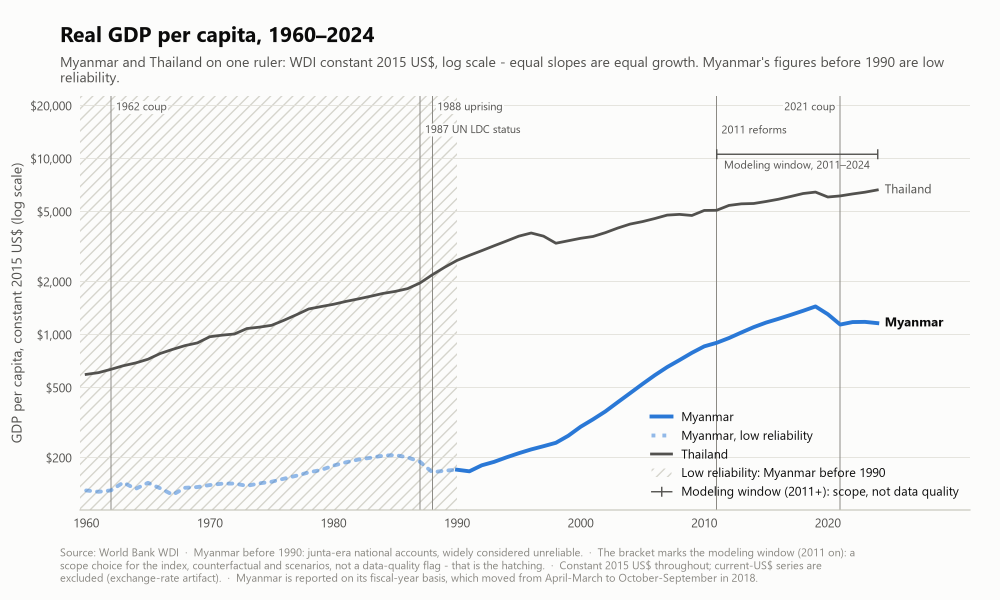

*Real GDP per capita in constant 2015 US$, log scale. On WDI's figures Myanmar barely grew from 1960 to 1990 (0.9% a year) while Thailand more than quadrupled, then Myanmar recovered ground on official growth rates that are themselves contested (about 11% a year in 2000–2010). Hatched years are low reliability; the bracket marks the 2011+ modeling window, a scope choice rather than a data-quality flag.*

**What extends, and what doesn't, is discovered from the data.** Every candidate series is pulled from 1960 and kept only if Myanmar has at least 20 *non-zero* observations before 2000. Zeros don't count: WDI records 0 mobile subscriptions for the years before mobile phones existed. Six series qualify: GDP per capita, GDP growth, life expectancy, under-5 mortality, secondary enrollment and population. The decision and its reason for every series are in `historical_coverage`.

**Three rulers, never spliced:**
- **WDI constant 2015 US$** is the spine.
- **Current-US$ series are excluded entirely.** Myanmar's kyat was converted at an official peg of about 6 per dollar, so pre-1990 dollar levels are an exchange-rate artifact. FDI as a share of GDP goes with them, because its denominator is current-US$ GDP.
- **Maddison PPP (2011 int$)** is optional and pre-1960 only. It goes on its own axis if you supply the export described in [`data/external/README.md`](data/external/README.md). No export is committed, so the chart above starts at 1960 and shows no pre-1960 data.

**Two cues, two concepts.**
- **Low reliability, before 1990:** Myanmar's junta-era national accounts. They are flagged in the data (`reliability = low`), and the charts hatch those years and draw the line dotted.
- **The modeling window, from 2011:** the years the index, counterfactual and scenarios are calibrated on. It is marked with a thin bracket. This is a scope decision, not a judgment on the 2000s data.

**The divergence scenario: an illustration, not an estimate.** It asks where Myanmar would be had it grown at Thailand's actual rate since 1960:
- It starts at Myanmar's actual 1960 level, `P(t) = P(t−1) · Y_THA(t) / Y_THA(t−1)`.
- A donor-pool-average variant averages the peers' log growth each year.

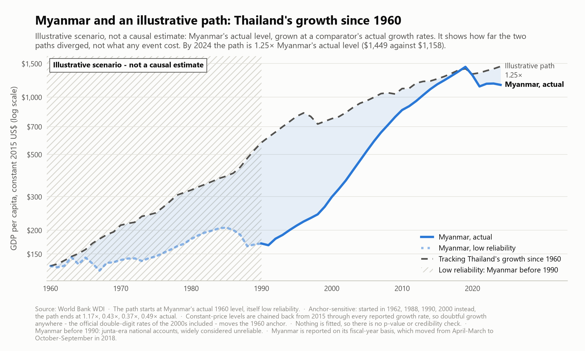

By 2024 the Thailand-tracking path is **1.25×** Myanmar's actual level ($1,449 against $1,158). That number **turns on the anchor**. Started in 1988, 1990 or 2000, the same path ends *below* actual (0.37–0.49×), because on official figures Myanmar outgrew Thailand after 1988. Every scenario is re-run from each anchor in `historical_divergence_sensitivity`, and the chart states the range.

The gap bundles everything that differed between the two countries, including coups, policy, conflict, sanctions, prices and measurement error. Thailand had six coups of its own. So the path attributes nothing to any cause, and it carries no p-value or credibility verdict (`scenario_illustrative = True` on every row). The reasons there is no long-run synthetic control are in [LIMITATIONS.md](docs/LIMITATIONS.md#why-there-is-no-long-run-counterfactual-estimate).

```bash
make historical                                     # pulls (cached) 1960–2024, tables + charts
python scripts/build_historical.py --anchor 1962    # re-anchor every divergence scenario
python scripts/build_historical.py --refresh        # re-pull the long series
```

This writes to `data/processed/`:

- `historical`: `country_iso3, year, indicator_id, value, source, reliability`, with `source` either `wb_constant` or `maddison`. It is separate from the 2011+ panel.
- `historical_coverage`: every candidate's decision (`extends`, `insufficient` or `excluded_ruler`) and why.
- `historical_divergence`: actual, path, gap and ratio by scenario and year.
- `historical_divergence_metrics`: anchor, comparator, latest-year ratio and gap, annualized growth, `scenario_illustrative`.
- `historical_divergence_sensitivity`: the same metrics from each sensitivity anchor.

**In the app.** The Historical arc view draws both charts from `GET /historical` and `GET /historical/divergence`, with the same cues: hatching and a dotted line for low reliability, a capped bracket for the modeling window, and an *Illustrative scenario* badge and banner on the divergence. It points to the Counterfactual view for the rigorous 2021 estimate.

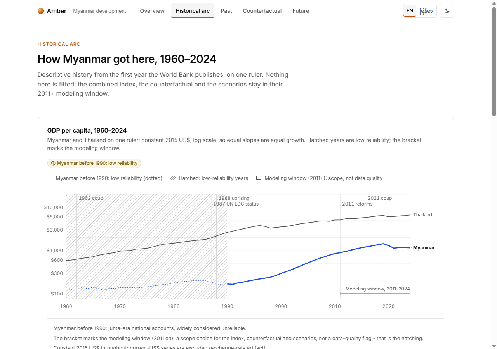 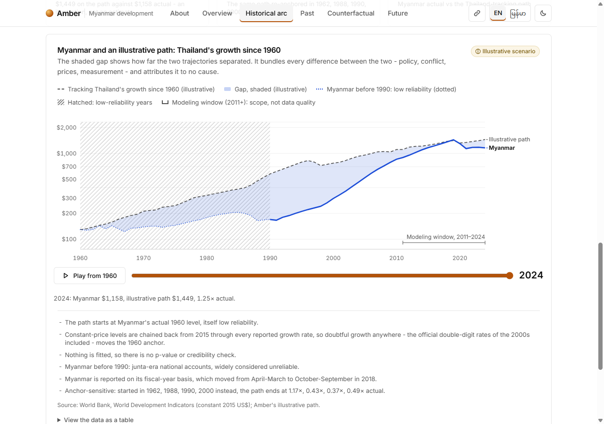

The method is in [METHODOLOGY.md §6](docs/METHODOLOGY.md#6-the-historical-arc-and-the-divergence-scenario).

---

## App

The web app puts all three layers, and the historical arc, behind one interface. Its FastAPI backend serves the model outputs, and it has five views:

- **Overview** – what Amber is, and the GDP-per-capita divergence.
- **Historical arc** – Myanmar against Thailand from 1960, with the dated markers, the pre-1990 low-reliability cue and the 2011 modeling-window bracket; then the illustrative divergence, with a comparator switch, the anchor range and a link to the Counterfactual view.
- **Past** – GDP per capita and the combined index for all seven countries. Three pillar-weight sliders recompute the index live.
- **Counterfactual** – for each outcome: real against synthetic Myanmar, the gap against the placebos, and the donor weights.
- **Future** – choose a stability path and move the policy levers. Each change reruns the calibrated model live and re-tweens the fan chart. A player steps through the years: World Bank history to 2024, then the scenario's median and p10–p90 range, with the three pillar scores as bars against actual continuation.

**What is precomputed and what runs live.** Only two things are computed when you move a control, and both are cheap forward passes. Nothing is ever refitted on a request.

| Endpoint | Computed | What it serves |
|---|---|---|
| `GET /meta` | once, at startup | Countries, indicators, pillars and default weights, levers (range, step, default), scenarios and framing text, each display string with an English and Burmese twin. All of it comes from `config.py` and `i18n.py`, so the UI hardcodes none of it. |
| `GET /panel` | precomputed | Tidy indicator series with `imputed` and dark-series flags |
| `GET /index?weights=economy=2,innovation=1,human_development=1` | **live**: `compute_index` | Pillar and combined index for every country, with `coverage` on every row |
| `GET /counterfactual` | precomputed | For each outcome: actual, synthetic and gap, donor weights, placebos (with `poor_fit`), in-time placebo, the leave-one-out band, and the metrics, including `credible`, `pre_rmse_share`, `pseudo_p_value`, `n_effective_donors` and `n_weighted_donors` |
| `GET /scenarios` | precomputed | Every scenario at p10, p50 and p90 (stocks, indicators, pillars, combined), paired gaps, and the `sd_metrics` verdicts |
| `GET /historical?countries=MMR,THA&indicators=NY.GDP.PCAP.KD` | precomputed | 1960+ rows, each with its `source` (`wb_constant` / `maddison`) and `reliability`, plus the dated markers, the modeling window and the reliability rule |
| `GET /historical/divergence?comparator=THA` | precomputed | Actual vs the illustrative path by year, the latest-year metrics, the anchor sensitivity, and `scenario_illustrative: true` - no p-value, no credibility verdict |
| `POST /simulate` | **live**: `run_scenarios` | Same shape as a scenario. Levers override a named scenario. It runs on the stored calibration and profile nodes, and a named scenario reproduces its precomputed run to about 10⁻¹⁰. |

Bad input gets a 422 with a readable message: an unknown pillar, lever, scenario, indicator or country; a lever out of range; negative, all-zero or malformed weights.

**The caveats travel with the data.** Every response that carries a modeled series also carries its verdict, and the UI shows it wherever the series appears:
- An index row with `coverage` below 1 is drawn as a hollow point.
- A counterfactual with `credible: false` gets a banner saying it is not a credible effect estimate. Its charts are badged "illustrative", and its gap is not reported as an effect.
- The Future view always shows "Scenarios, not forecasts". It switches to "illustrative dynamics" if the model fails its backtest gate, and states the phase 3 overlap check and the composition step.

Frontend tests pin each of these, in CI:
- the banner renders for a `credible: false` payload;
- the Future view keeps its caveat badge and framing while a lever change is re-running;
- partial coverage reaches the legend, the notes and the data table;
- a cold-starting API shows "waking the server" and then loads;
- a 422 is explained, not retried;
- the not-credible, scenario and illustrative banners render in Burmese too, with scenario and lever names from `/meta`'s twins.

`frontend/scripts/smoke.mjs` checks the same caveats in a real browser at desktop and phone width, in English and then in Burmese.

```bash
make api            # uvicorn on :8000, serving data/release
make frontend-install
make frontend-dev   # Vite on :5173, calling the API
```

`AMBER_DATA_SOURCE=processed make api` serves your latest `make models` output instead of the committed snapshot. The frontend reads `VITE_API_BASE_URL`, which defaults to `http://localhost:8000`.

### Internationalization

The app is in **English and Burmese (မြန်မာ)**, English by default.
- **Choosing a language.**
  - The first visit follows the browser's language: a reader whose browser asks for `my` gets Burmese.
  - The **EN / မြန်မာ** toggle in the header switches at any time. Each option is named in its own script, and both work by keyboard.
  - The choice lives in memory for the session, with no storage, and `<html lang>` always names the language on screen.

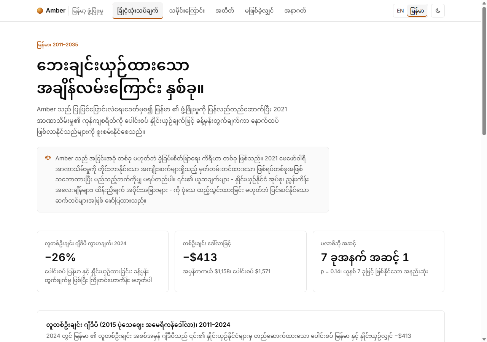 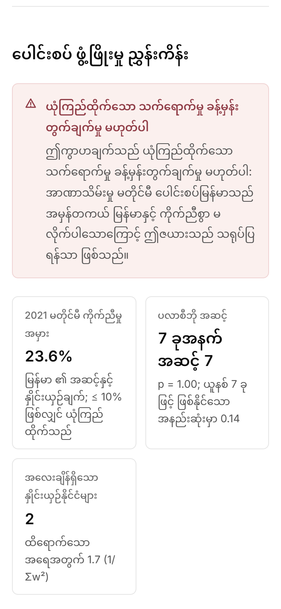

- **Everything is translated, the data labels included.**
  - The UI's own copy lives in [`en.json`](frontend/src/i18n/locales/en.json) and [`my.json`](frontend/src/i18n/locales/my.json).
  - Every name and caveat the API sends arrives with a Burmese twin: countries, indicators, pillars, levers, scenarios, regime markers and every caveat (`name` beside `name_i18n: {en, my}`). The twins come from the config-side label map, [`src/amber/i18n.py`](src/amber/i18n.py).
  - The app swaps each field for the active language as data arrives, so Burmese mode cannot show an English series name. The numbers are untouched.
- **Honest about the translation.**
  - The Burmese is a machine-assisted first pass.
  - The honesty strings are an exception: "scenario, not a forecast", "not a credible effect estimate", "illustrative scenario, not a causal estimate", and the coverage and low-reliability notes. These, and the labels for political events, are flagged `human-verify`, and listed with a glossary in [docs/i18n-review.md](docs/i18n-review.md).
  - While any flag is pending, the Burmese footer says so.
  - An English caveat edited later breaks its Burmese lookup, so it cannot ship with a stale translation.
- **Numerals stay Western in both languages:** 2021, $1,158, 26%, never ၂၀၂၁.
  - This covers chart axes, tooltips, stat callouts and tables.
  - Technical and financial writing in Myanmar reads Western digits, and it keeps the charts legible.
  - The formatters are pinned to `en-US`. Labels and units are translated; digits are not.
- **Burmese type.**
  - Burmese is set in [Noto Sans Myanmar](https://fonts.google.com/noto/specimen/Noto+Sans+Myanmar) (SIL OFL), self-hosted, and in Unicode only, never Zawgyi; the label maps are checked for it.
  - Only its Myanmar face is registered, so Latin text and digits stay in Inter, and the 154 kB font downloads only when Burmese is on screen.
  - Under `lang="my"` the type tokens add leading for stacked glyphs and drop letter-spacing.
  - The smoke test checks, in a real browser at 1280 and 375 px:
    - that the Burmese is painted in Noto, not tofu;
    - that no text is clipped;
    - that no English names remain;
    - that every caveat is still on screen in Burmese.
- **Cost:**
  - English readers download about 5.5 kB more gzipped JavaScript.
  - The Burmese catalog is its own 9 kB chunk, fetched only when Burmese is chosen.

---

## Deployment

The deployed API never calls the World Bank. It serves **`data/release/`**, a committed snapshot of the 19 tables it needs (about 0.8 MB).
- Its `manifest.json` records the build time, the source commit, and a SHA-256 hash and row count for every file.
- The API checks those hashes at startup, so a hand-edited or half-regenerated snapshot fails loudly.
- A test starts the API with outbound connections blocked, so the guarantee is enforced rather than only promised.

Regenerate the snapshot deliberately after the models change, never by hand: `make models && make release`, then commit `data/release/`.

**[DEPLOY.md](DEPLOY.md)** is the step-by-step runbook: the API on Render (a [`render.yaml`](render.yaml) Blueprint) and the app on Vercel ([`frontend/vercel.json`](frontend/vercel.json), root directory `frontend`). It covers the environment variables on each side, connecting them through CORS, a post-deploy smoke checklist, manual QA, and the GitHub About settings. Both `.env.example` files ([root](.env.example), [frontend](frontend/.env.example)) list every variable, and none is a secret.

On Render's free tier the API sleeps when idle and takes up to a minute to wake. The app says so, *"Waking the server - this can take up to a minute"*, and retries on its own.

---

## Status

🟢 **v1.0.0: complete and ready to deploy.** All three layers, the API that serves them, and the web app are built, tested and documented. Every number is an estimate or a scenario, and the app says so wherever it shows one. Release notes are in [CHANGELOG.md](CHANGELOG.md). The release is meant to be tagged `v1.0.0` on GitHub; see [DEPLOY.md](DEPLOY.md#6-repository-finishing-touches).

### Roadmap
- [x] Scope + methodology
- [x] Collect pre-coup plans & baseline trajectory
- [x] **Data layer** — fetch, cache, and clean the indicator panel
- [x] **Past reconstruction + combined index**
- [x] **Synthetic-control counterfactual**
- [x] **System-dynamics future scenarios**
- [x] **API + frontend** — FastAPI over a committed snapshot, React app with live weights and levers
- [x] **Deploy config** — Render (API) and Vercel (frontend), hermetic release data
- [x] **Polish & hardening** — cold-start handling, accessibility, mobile, caching, methodology/limitations docs, deploy runbook
- [x] **Historical arc** — 1960+ descriptive layer with reliability flags, and an illustrative long-run divergence scenario
- [x] **Historical arc in the app** — `/historical` and `/historical/divergence`, and the Historical arc view
- [x] **Motion** — line draws, the counterfactual reveal, the growing fan and the year-by-year player, all off under reduced motion
- [x] **English + Burmese** — every string and data label in both, Noto Sans Myanmar, Western numerals; the honesty strings await a Burmese speaker's review

---

## License

[MIT](LICENSE) © 2026 Htet Aung Lwin (Zorrow). The World Bank data in `data/release/` remains under [CC BY 4.0](https://creativecommons.org/licenses/by/4.0/); see [Data and attribution](#data-and-attribution).

*A portfolio project. The name is a placeholder for a question: what colour is a future that didn't happen?*
