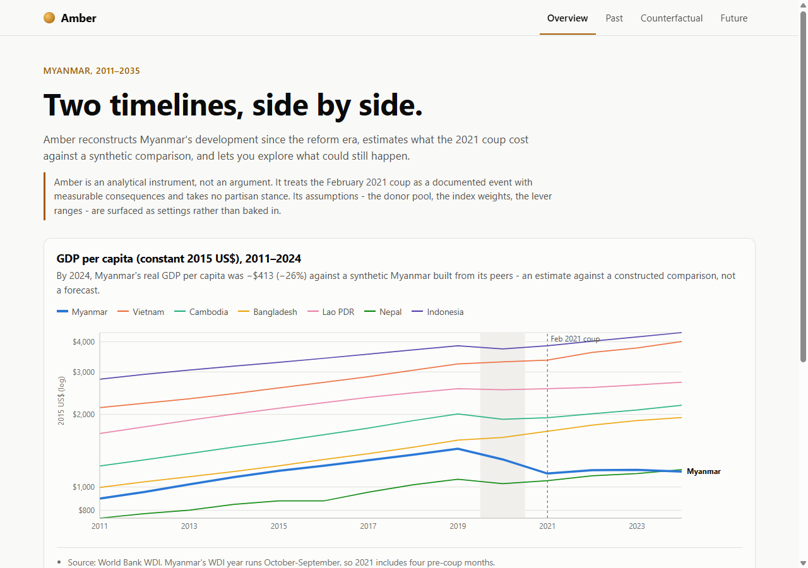
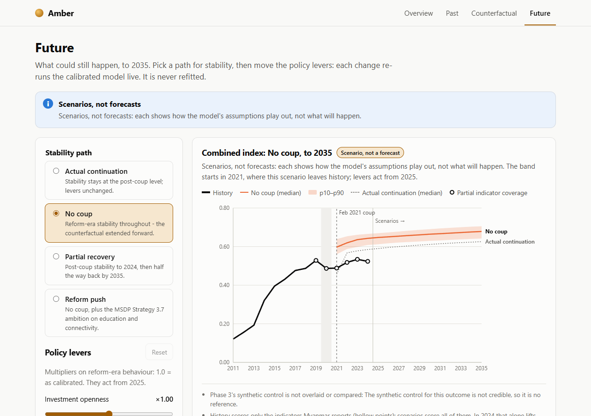
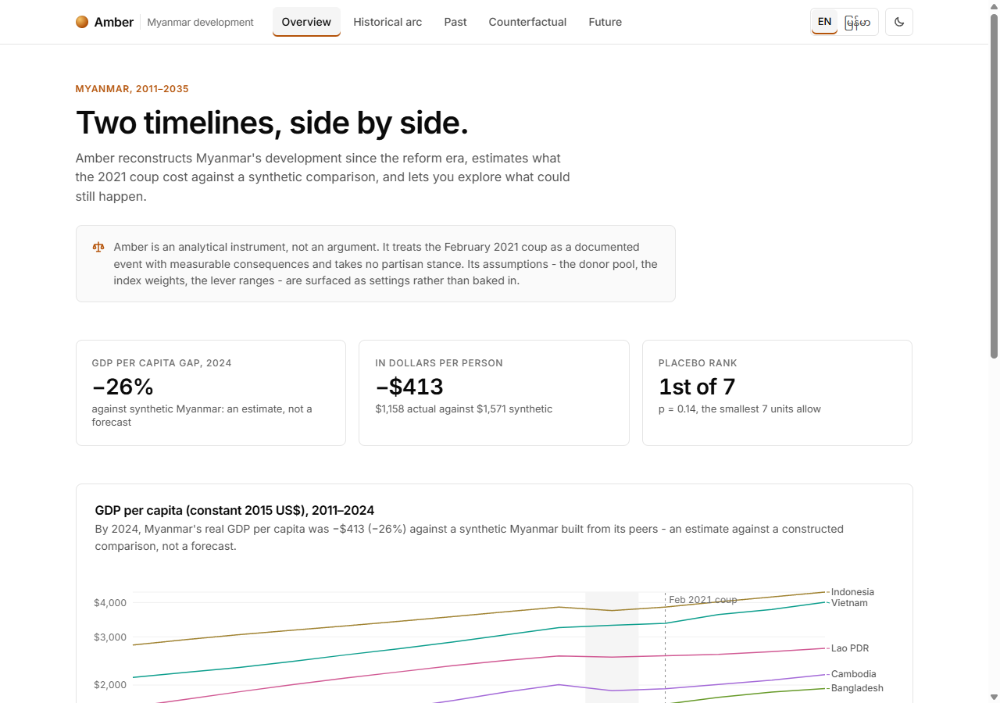
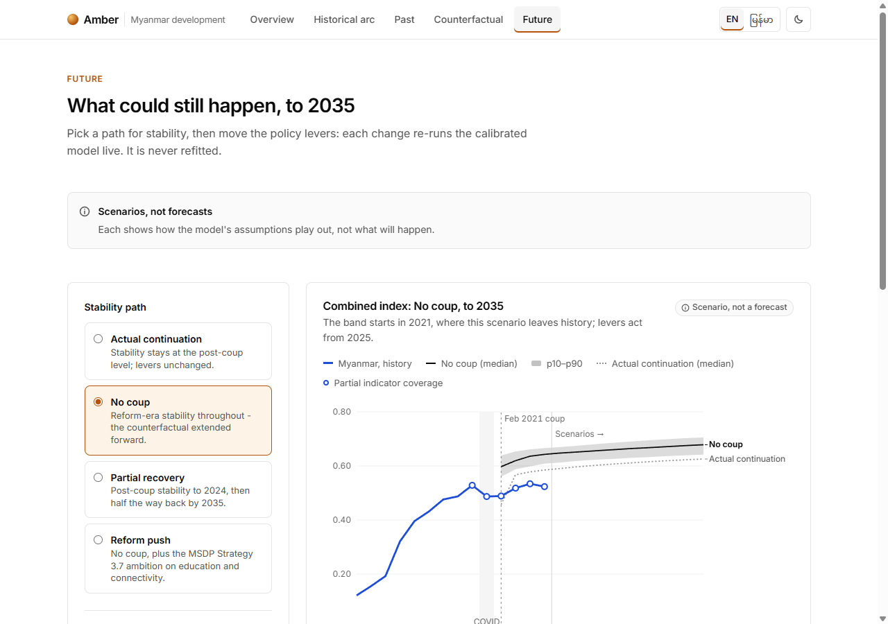

# Design system

Amber's interface follows a calm, near-monochrome analytical style, in the spirit of Linear and Vercel:
- hairline borders rather than shadows;
- generous whitespace;
- one amber accent;
- charts that look like they came from the same hand.

This page documents the tokens and the rules that use them.

**Source of truth:**
- [`frontend/src/styles/tokens.css`](../frontend/src/styles/tokens.css) holds every color, size, space, radius, shadow and motion value.
- [`frontend/src/lib/chartTokens.ts`](../frontend/src/lib/chartTokens.ts) holds the chart geometry Recharts needs as numbers.

Components use `var(--token)` and never carry their own hex or pixel values.

**Before and after** (the same build, data and viewport):

| | Overview | Future |
|---|---|---|
| Before |  |  |
| After |  |  |

---

## Color

Color has three jobs, and each job has its own palette. The palettes never borrow from one another.

### 1. Neutral ramp (the UI)

| Token | Light | Dark | Use | Contrast (on surface) |
|---|---|---|---|---|
| `--bg` / `--surface` | `#ffffff` / `#ffffff` | `#0a0a0a` / `#111111` | page, cards | |
| `--surface-subtle` | `#fafafa` | `#161616` | tints, table heads | |
| `--surface-hover` | `#f5f5f5` | `#1c1c1c` | hover, active tab | |
| `--border` | `#e5e5e5` | `#262626` | hairlines | decorative |
| `--border-strong` | `#d4d4d4` | `#333333` | inputs, hover borders | decorative |
| `--text-1` | `#0a0a0a` | `#ededed` | primary text | 19.8 / 16.1 |
| `--text-2` | `#525252` | `#a3a3a3` | secondary text | 7.8 / 7.5 |
| `--text-3` | `#6b6b6b` | `#8f8f8f` | tertiary text, axis ticks | 5.3 / 5.8 |

Every text token clears WCAG AA (4.5:1) on every surface it sits on, hover tints included, in both themes.

### 2. The accent (interactive, active, brand)

Refined amber: `--accent` is `#b45309` (light) and `#f5a524` (dark). It's used only for:
- the active tab;
- slider fills and radios;
- the focus ring;
- eyebrows and calls to action;
- the brand mark.

It never appears in a chart.

### 3. Data palette (the series)

The treated country is the **hero**, a strong blue. The six donors take slots 1–6 in `/meta` order (`countryColors` in `lib/theme.ts`). So every chart colors a country identically, the frontend never names a country, and a filter can never repaint the survivors.

| Slot | Light | Dark |
|---|---|---|
| `--data-hero` | `#1d4ed8` | `#4f7ff0` |
| `--data-1` | `#0d9e8d` | `#159c8c` |
| `--data-2` | `#a46ad8` | `#9c76de` |
| `--data-3` | `#679a29` | `#6f9d33` |
| `--data-4` | `#d15a94` | `#d0659f` |
| `--data-5` | `#3a8ec0` | `#3497c4` |
| `--data-6` | `#a08332` | `#a8893b` |

**How donors stay recessive.** Desaturating them was rejected because it fails the validator's chroma floor: the lines read as gray and can't be told apart. Instead, donors keep their chroma and recede by weight: 1.5px strokes against the hero's 2.75px. Every line also carries a direct end label, so color is never the only cue.

**Validated** with the dataviz skill's `validate_palette.js` (light on `#ffffff`, dark on `#111111`):

| Check | Light | Dark |
|---|---|---|
| Lightness band | pass (L 0.43–0.77) | pass (L 0.48–0.67) |
| Chroma floor (≥ 0.10) | pass | pass |
| Adjacent CVD separation (target ΔE ≥ 8) | pass, worst 8.6 | pass, worst 8.1 |
| Normal-vision floor (ΔE ≥ 15) | pass, worst 20.7 | pass, worst 19.6 |
| Contrast vs surface (≥ 3:1) | pass | pass |

**Modeled lines are neutral.** Whatever is constructed is drawn in neutral ink, told apart by stroke:
- synthetic Myanmar is dashed;
- a scenario median is solid, over a soft band;
- the baseline scenario is dotted;
- placebos are thin.

Real Myanmar is always the hero. `--chart-faint` (poor-fit placebos, about 1.8:1) is deliberately below 3:1. Those lines are fit failures, kept for the p-value, and they're also dashed, labelled in the legend and listed in the data table.

### 4. Honesty signals

These are deep text tones on pale tints. They always come with an icon and a title, so they're never color alone, and they stay calm: legible and unmissable, never alarming.

| Signal | Token | Light fg / bg | Dark fg / bg | Text contrast |
|---|---|---|---|---|
| Partial coverage | `--caution-*` | `#7c5e10` / `#fbf5e6` | `#f2d27a` / `#2a2410` | 5.6 / 10.5 |
| Not credible | `--critical-*` | `#8f3b45` / `#fbf0ee` | `#f2a49c` / `#2c1715` | 6.5 / 8.5 |
| Framing, info | `--info-*` | `#525252` / `#fafafa` | `#a3a3a3` / `#161616` | 7.5 / 7.2 |

**Collision check** (OKLab ΔE×100 against every series color):
- The not-credible tone clears every series at **ΔE ≥ 17**.
- The caution tone and the accent sit about **ΔE 11.5** from the tan donor slot, with every other slot at ≥ 15.

That residual is accepted, for three reasons:
- The accent never appears in a chart.
- The caution tone appears only in pills that carry an icon and a label.
- In charts, partial coverage is encoded by **shape** (a hollow ring in the series' own color), not by the caution hue.

---

## Type

[Inter Variable](https://rsms.me/inter/) is self-hosted through `@fontsource-variable/inter`, weight axis only. Browsers fetch just the 48 kB Latin file. It falls back to the system UI stack.

**Tabular figures everywhere:** numbers, axis ticks, tooltips, tables and slider values all use `font-variant-numeric: tabular-nums`.

| Token | Size | Use |
|---|---|---|
| `--text-2xs` | 11px | chart ticks at phone width |
| `--text-xs` | 12px | eyebrows, chart ticks, captions, pills |
| `--text-sm` | 13px | notes, legends, hints |
| `--text-base` | 14px | UI body |
| `--text-md` | 16px | ledes, chart titles |
| `--text-lg` | 20px | section titles |
| `--text-xl` | 28px | view titles (H1), stat values |
| `--text-2xl` | 40px | the overview headline |

Line heights are 1.15 for headings, 1.35 for notes and 1.55 for prose. Large headings are tracked −0.015 to −0.025em.

### Burmese

Burmese (`lang="my"`) is set in [Noto Sans Myanmar](https://fonts.google.com/noto/specimen/Noto+Sans+Myanmar), self-hosted through `@fontsource-variable/noto-sans-myanmar` ([`styles/fonts.css`](../frontend/src/styles/fonts.css)).
- **Font stack.** Only its Myanmar-script face is registered, and it sits after Inter in `--font-sans`. A mixed line keeps Inter's Latin text and digits and shapes each Burmese cluster in Noto. The 154 kB file downloads only when Burmese is on screen.
- **Unicode only.** Zawgyi text would render as broken clusters, by design.
- **Type tokens.** Burmese stacks consonants, medials and vowel signs above and below the line, so `:root[lang="my"]` changes the tokens rather than any component:
  - the small sizes go up a step (11/12/13/14 → 12/13/14/15 px);
  - leading goes to 1.5 for headings and the display line, 1.65 for notes and 1.85 for prose;
  - tracking goes to 0, because letter-spacing pulls clusters apart.
- **The toggle's endonym (မြန်မာ)** keeps Burmese leading on the English page too (`--leading-myanmar`).
- **Digits stay Western in both languages,** in Inter's tabular figures, so charts, stats and tables read identically.
- **Contrast is unchanged.** Burmese uses the same text tokens, so every AA ratio above holds.
- **Wrapping.** Lines break at Burmese word boundaries; Chromium does not apply `word-break: keep-all` to Myanmar script. Where a break split a phrase badly, as in the overview headline, the wording was adjusted.

## Space, shape, depth, motion

- **Space:** a 4px scale. The tokens `--space-1 … --space-16` cover 4, 8, 12, 16, 20, 24, 32, 40, 48 and 64.
  - Views separate sections by 48px.
  - Cards pad by 24px, or 16px at phone width.
- **Radius:** `--radius` (8px) is used everywhere; `--radius-sm` (6px) is for controls and `--radius-full` for pills.
- **Depth:**
  - Separation comes from 1px hairlines and subtle surface tints.
  - One soft shadow, `--shadow-elevated`, is reserved for genuinely floating surfaces: the tooltip and the focused skip link.
  - The sticky header uses a translucent background with a backdrop blur.
- **Motion:** 150ms, applied to hover and active colour changes only. Skeletons pulse gently, and `prefers-reduced-motion` removes all of it.

---

## Primitives

| Component | What it standardizes |
|---|---|
| `AppShell` | Quiet sticky bar with the brand, views (active state: accent underline and tint) and the theme toggle; main column; footer |
| `SectionHeader` | Eyebrow → title → description. One H1 per view; H2 for sections |
| `Card` | Hairline border, generous padding, one radius |
| `ChartFrame` | Every chart: title and claim, caveat pill and status, honesty callout slot, keys, plot, notes and source, data table, screen-reader summary |
| `ControlPanel`, `ControlGroup`, `Slider` | Controls grouped apart from their output; every slider shows its live value |
| `StatCallout`, `StatRow` | Headline numbers: label, large tabular value, context |
| `Banner`, `Pill` | The honesty signals and framing, by tone (`info`, `caution`, `critical`), each with an icon |
| `Loading` (skeleton), `Waking`, `FetchError`, `Async` | Load states: skeletons rather than spinners, with the cold-start and error states as banners |

## Chart grammar

All charts build from [`charts/common.tsx`](../frontend/src/charts/common.tsx):

- **No chart-junk.** No plot border or background, faint horizontal rules only, and a hairline baseline. The value axis has no line and five formatted ticks; years are ticked every 2 (every 4 on phones).
- **Direct labels.** [`EndLabels`](../frontend/src/charts/EndLabels.tsx) labels each line at its right end. It uses the axis scales to nudge labels apart, with a leader line in the series color. The text stays in text tones. At phone width the labels drop out, and a per-series legend takes their place.
- **One treatment line.** A thin dashed rule with a small "Feb 2021 coup" label, on every time series. COVID is a faint labelled tint. "Scenarios →" marks where projections begin.
- **One tooltip.** [`ChartTooltip`](../frontend/src/charts/ChartTooltip.tsx) is a single card with right-aligned tabular values, sorted. It also carries notes, such as partial coverage.
- **Coverage is a shape.** Partial-coverage points are hollow rings, wherever the index is drawn.
- **Two historical cues, never merged.** Low reliability (the measurements are suspect) is 45-degree hatching (`--chart-hatch`, 3.2:1 light, 3.6:1 dark) behind those years, with the line dotted at series weight. The modeling window (a scope choice) is a thin capped bracket along the foot of the plot ([`WindowBracket`](../frontend/src/charts/WindowBracket.tsx)). Each has its own named legend swatch (`hatch`, `bracket`), so neither rests on color. Long series tick by decade, and the log axis is padded so lines clear the event labels.

## Motion

Motion answers what the data does: a line draws its path, the fan widens into the future, a number arrives at its value. It never carries meaning on its own, and no caveat waits for it.

- **One source of timing.**
  - Durations Recharts and rAF need are in [`lib/motion.ts`](../frontend/src/lib/motion.ts) (`MOTION`): draw 900 ms, follow at 60%, band 1300 ms, tween 600 ms, scrubber step 500 ms, step tween 240 ms.
  - CSS durations are tokens: `--duration` 150 ms, `--duration-slow` 320 ms, `--duration-tween` 240 ms.
- **One orchestrated moment per chart.** Series reveal in reading order: real before modeled, history before scenario. The gap fills last, and only where the estimate is credible.
- **The player** is the one interactive set piece. It starts at the final year and plays only when asked. Its values move in 240 ms, well inside each 500 ms step, so a number is never shown between two years.
- **Caveats are never animated or deferred.**
  - Banners, badges and pills are DOM and render with the data.
  - Coverage rings sit on a static chart layer.
  - Reference areas (COVID, low-reliability hatching) and the window bracket never animate.
  - The view settle moves by transform, never opacity.
- **Reduced motion** turns every one of these off, through `useReducedMotion` for JS and `base.css` for CSS. Durations and delays both go to 0, and the final state renders at once.

## Accessibility

- AA contrast holds for every text token in both themes.
- Graphics are ≥ 3:1, apart from the documented recessive poor-fit placebos.
- Every control shows a visible focus ring, and there is a skip link.
- No distinction rests on color alone: weight, dash, end labels, icons and titles carry it too.
- Every chart keeps a screen-reader summary and a data table.
- The theme toggle lives in memory only, so the app keeps no storage. Charts re-read the tokens on every switch.
